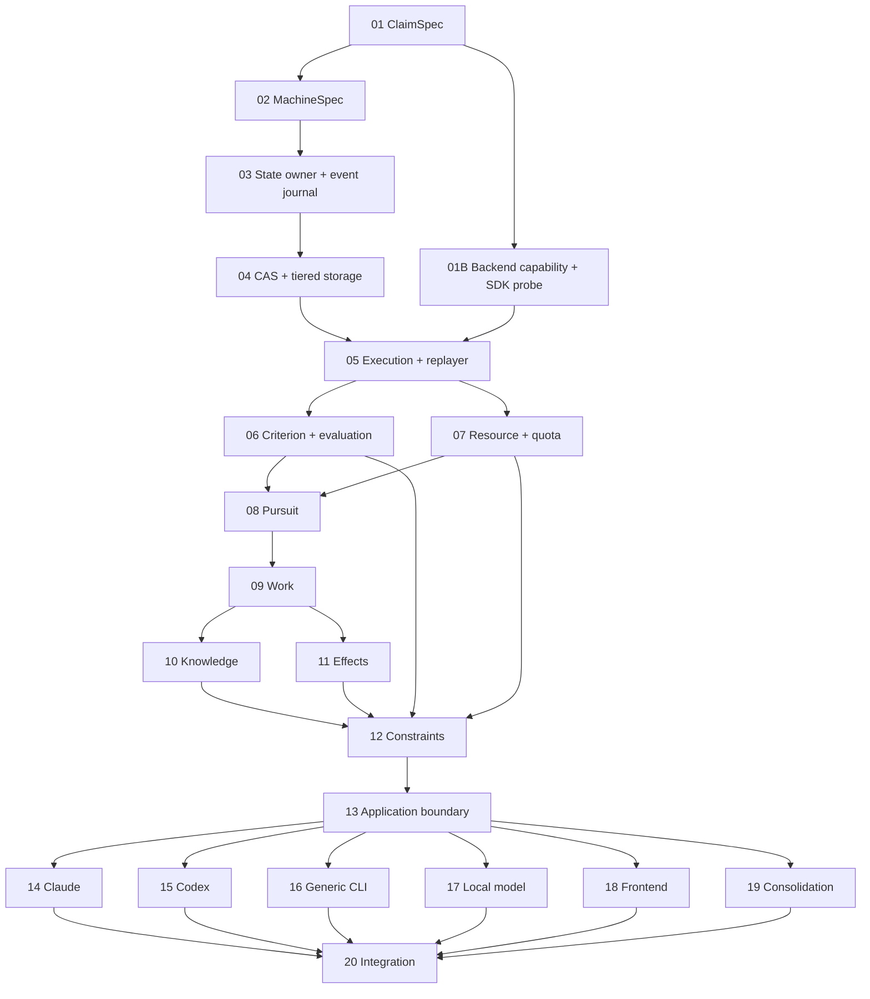

# nova 重做實作計畫總覽

> **For agentic workers:** REQUIRED SUB-SKILL: Use `superpowers:subagent-driven-development` (recommended) or `superpowers:executing-plans` to implement each plan task-by-task. Steps use checkbox (`- [ ]`) syntax for tracking.

**Goal:** 【推論】把已雙方簽字並經控制端複驗的 nova 設計拆成 21 個可各自交付、各自驗收的子系統，依信任根順序建成可恢復、可核銷、可裁定的不可靠執行者 harness。

**Architecture:** 【推論】主軸是 Work → Pursuit → Execution 三個生命週期；判準、資源、效果、知識是四個橫向權威；CAS／證據與 application boundary 不取得領域終態權。所有行為保證先落成 ClaimSpec＋正控＋固定負控，再由 MachineSpec、單一 state owner 與持久事件把規則承載起來。

**Tech Stack:** 【推論】CPython 3.14.7、pytest 9.1.1、Hypothesis、pytest-xdist 3.8.0、mutmut 3.7.0、SQLite rollback／WAL 雙 profile、JSON Schema 2020-12、TypeScript、原生 Web Components、Vite、Graphviz、SSE。

**Specs:** 【查證】[第三輪](../sol-新局-第三輪.md)、[第四輪](../sol-新局-第四輪.md)、[第五輪](../sol-新局-第五輪.md)、[前端需求](../需求-前端控制.md)、[約束需求](../需求-約束注入.md)、[定期整併需求](../需求-定期整併.md)與[雙方簽字](../控制端審查.md#六簽字2026-08-26)。

## Global Constraints

- 【推論】`.python-version` 固定 `3.14.7`；Python 套件與工具都由 `uv.lock` 固定，不接受浮動 minor／patch。
- 【實測】pytest 必須設定中文與英文 discovery：`python_files=["測_*.py","test_*.py"]`、`python_functions=["測試_*","test_*"]`、`python_classes=["測_*","Test*"]`、`pythonpath=["."]`。
- 【實測】mutmut 使用 `source_paths`；`tests_dir` 與 `also_copy` 都是 list。原始 mutation kill rate 不是 gate；只有事前命名的 mutation／固定錯誤 subject 必須被指定 predicate 殺掉。
- 【推論】每個 task 先寫一個會紅的 test／ClaimSpec direct check，實際跑到指定失敗，再寫最小實作，跑綠後才 commit；不得先寫 production code。
- 【推論】每個 object 預設拒絕 unknown fields；跨程序 semantic id、event/schema field、DB table/column、CLI executable 與 failure code 用 ASCII，中文可用於檔名、Python identifier 與顯示文字。
- 【推論】候選執行者不能自報完成、延長 deadline、改 budget、改 criterion、啟用 constraint、改 effect receipt 或寫 state DB。
- 【推論】v1 isolation 明示 `COOPERATIVE_PROCESS`；required capability 不足只回 typed `UNSUPPORTED_*`，不得靜默降級。
- 【推論】任何計畫若前置 ClaimSpec 未綠，不得用 mock 的 PASS 繞過依賴 gate；fake port 只可模擬輸入，不能偽造前置不變式已成立。

---

## 1. Brainstorming：拆法與採用理由

【查證】官方 `brainstorming` 要求大型架構先拆成彼此可理解、可獨立測試的 sub-project；`writing-plans` 要求每個獨立子系統一份 plan，且 task 之前先鎖 File Structure。（來源：[brainstorming SKILL.md](https://github.com/obra/superpowers/blob/main/skills/brainstorming/SKILL.md)、[writing-plans SKILL.md](https://github.com/obra/superpowers/blob/main/skills/writing-plans/SKILL.md)。）

| 拆法 | 代價 | 判決 |
|---|---|---|
| 依 controller／service／repository 技術層切 | 【推論】每份計畫都跨七個權威；一個 reviewer 無法只批准一支筆，測試也無法宣告誰有終態權。 | 【推論】拒絕。 |
| 依使用者畫面做垂直 slice | 【推論】很快能畫出 UI，但 ClaimSpec、MachineSpec 與 event durability 尚未可信，畫面會把 mock 狀態冒充領域事實。 | 【推論】拒絕。 |
| 依信任根 → 生命週期／權威 → 邊界／adapter → 整合切 | 【推論】每份計畫有一個 writer 或一個明確 port；前置失敗會在依賴 gate 被擋住；與簽字設計的權威、生命週期及 change axis 一致。 | 【推論】採用。 |

【推論】子系統不是按檔案數平均分。ClaimSpec、MachineSpec、state owner 是前三個信任根；四權威與三生命週期各有自己的計畫；外部 backend 因供應商一起變而各自一份；前端只在 GraphIR 與 event stream 已可信後開始。

---

## 2. 定期整併的新裁決：合併 representation，不縮 obligation

【推論】「active ClaimSpec digest 集合只准增加」量錯對象：兩份等價寫法合成一份時，representation 會減少，但行為義務不應減少。v1 改以 immutable `GuaranteeObligationId` 集合作為 no-weaken invariant；ClaimSpec 是覆蓋 obligation 的 executable realization，不是 obligation 本身。

```text
GuaranteeObligation
  obligation_id: SemanticId
  authority: AuthorityId
  subject_contract: ContractRef
  source_refs: non-empty SourceRef[]
  fixed_control_refs: non-empty ControlRef[]

ClaimCoverage
  claim_ref: ClaimRef
  covers: non-empty GuaranteeObligationId[]

ClaimMergeSpec
  merge_id: SemanticId
  source_claims: ClaimRef[2..4]
  successor_claim: ClaimRef
  preserved_obligations: GuaranteeObligationId[]
  preserved_controls: ControlRef[]
  escape_count_before: uint
  escape_count_after: uint
  approval_envelope_ref: ApprovalEnvelopeRef
```

【推論】合法 merge 必須同時滿足：來源 2–4 份、successor 恰 1 份、同 authority、同 subject contract major、所有 source obligation ids 逐一出現在 successor coverage、所有 fixed control refs 原封不動被 successor 執行、`escape_count_after ≤ before`、successor 正控綠且每個舊負控 direct red。Definition Authority 用一筆 transaction 啟用 successor 並把 source revisions 標成 `ALIASED`；舊 ids／evidence／controls 都不刪。

【推論】每個 simplification Work 最多帶 **1** 份 ClaimMergeSpec；超過 4 個來源就拆成多個 Work，讓每次變更有獨立 reviewer gate。這是 blast-radius 上限，不是降低 no-weaken 的 waiver；任何欄位不符直接 `CLAIM_MERGE_REJECTED`。

【推論】真正撤銷產品保證不是 simplify。它只能走 `RequirementChangeWork`：附 user-authority `RequirementRevocation`、影響 closure、替代行為 ClaimSpec 與 10 分鐘 one-use ApprovalEnvelope；simplification command set 根本沒有 retirement operation。如此 review／LLM 只能提 merge，不能把「更簡單」當刪保證的通行證。

【推論】mutation 驗收固定為 named controls：`MutationControlRef` 在執行前固定 target semantic anchor、operator／faulty subject digest 與 `must_fail_exactly` predicate ids。mutmut 全掃結果只進 diagnostic evidence；等價文字突變不得污染通過／失敗或成為百分比 KPI。

【推論】自動整併 v1 不存在。`SimplificationTriggerPolicy` 初版為 `MANUAL_STAGE_BOUNDARY`，signals 只記錄不觸發；若新增 threshold，必須有 policy revision、reason ref、回測 evidence 與固定「無理由常數」負控。這遵守新增需求「先量訊號，再證明預測力」。

---

## 3. 子系統清單

| NN | 子系統與計畫 | 獨立交付 | 實際前置 gate（含 transitives） |
|---:|---|---|---|
| 01 | [可執行保證語言](./01-可執行保證語言.md) | 【推論】ClaimSpec 由外部 runner 對 reference subject 綠、對固定錯誤 subject direct red。 | 【推論】無。 |
| 01B | [執行者能力契約與 SDK 探針](./01B-執行者能力契約與SDK探針.md) | 【推論】先釘 backend capability/tool/output/delegation/usage 契約，以 pinned SDK 靜態 probe 與有界 live evidence 阻止 Claude 能力假設拖到 adapter 階段才爆。 | 【推論】01。 |
| 02 | [宣告式狀態機](./02-宣告式狀態機.md) | 【推論】MachineSpec／FlowSpec 可編譯、證明 guard partition、拒絕非法轉移並生成 GraphIR。 | 【推論】01。 |
| 03 | [權威狀態與事件日誌](./03-權威狀態與事件日誌.md) | 【推論】single-owner SQLite transaction、declared-transition FK、tail publisher 與 kill matrix 可獨立運作。 | 【推論】01–02。 |
| 04 | [內容證據與分層儲存](./04-內容證據與分層儲存.md) | 【推論】CAS、EvidenceRecord、segments、checkpoint、retention、backup／restore 全部可崩潰重建。 | 【推論】01–03。 |
| 05 | [執行封套與重播器](./05-執行封套與重播器.md) | 【推論】純函式 replayer 可經真正 supervisor 達成外部 wall／round／call／output 上限與 typed terminal，並消費工具／輸出／代理能力契約。 | 【推論】01、01B、02–04。 |
| 06 | [判準評估與隔離回饋](./06-判準評估與隔離回饋.md) | 【推論】CriterionVersion／Evaluation、capability negotiation、雙測試池與 clause reducer 可獨立裁定。 | 【推論】01–05。 |
| 07 | [資源預算與供應商額度](./07-資源預算與供應商額度.md) | 【推論】reserve／settle、RateCard、per-bucket 五態、probe、allocation policy 與 scheduler 可獨立測。 | 【推論】01–05。 |
| 08 | [目標追求生命週期](./08-目標追求生命週期.md) | 【推論】一個 Pursuit 可多次 Execution、pause／resume／換後端，並在 attempt／budget／deadline 下必停。 | 【推論】01–07。 |
| 09 | [持久工作協調與選拔](./09-持久工作協調與選拔.md) | 【推論】Work 擁有平行 Pursuit portfolio、持久 queue、deterministic selection、7 天 deadline與維護提案。 | 【推論】01–08。 |
| 10 | [知識治理與快照](./10-知識治理與快照.md) | 【推論】有來源、TTL、撤銷傳播的 KnowledgeAssertion 與 deterministic snapshot／retrieval。 | 【推論】01–09。 |
| 11 | [外部效果與後端更新](./11-外部效果與後端更新.md) | 【推論】outbox intent、at-least／at-most relay、receipt 與 drain-update-verify-quarantine flow。 | 【推論】01–09。 |
| 12 | [可宣告約束與權威閘](./12-可宣告約束與權威閘.md) | 【推論】ConstraintSpec admission、ADVISORY assembly、owner-local ENFORCED gates、expiry 與 proposal-only governance。 | 【推論】01–11。 |
| 13 | [應用服務與外部介面](./13-應用服務與外部介面.md) | 【推論】CLI／Python／HTTP 共用一個 command boundary，GraphBundle 與 SSE 只讀事件 port。 | 【推論】01–12。 |
| 14 | [Claude Agent SDK 後端](./14-Claude-Agent-SDK後端.md) | 【推論】SDK event、terminal、context、工具／輸出／代理成本、ambient closure、quota buckets 與 fingerprint 映射通過共用 backend contract。 | 【推論】01、01B、02–13。 |
| 15 | [Codex CLI 後端](./15-Codex-CLI後端.md) | 【推論】argv process、JSONL observations、token_count quota、context 與 convergent update 通過 contract。 | 【推論】01–13。 |
| 16 | [通用 CLI 後端](./16-通用CLI後端.md) | 【推論】無 shell 的 typed argv template 支援其他 CLI agent，未知輸出不被猜成成功。 | 【推論】01–13。 |
| 17 | [本地模型後端](./17-本地模型後端.md) | 【推論】NOT_APPLICABLE quota、零外部花費、同一 execution contract 與 hard process limits。 | 【推論】01–13。 |
| 18 | [前端視覺事件流](./18-前端視覺事件流.md) | 【推論】GraphIR＋event prefix＋now 的純 reducer畫三層 token、系統健康、quota 五態與低頻控制。 | 【推論】01–13。 |
| 19 | [定期整併](./19-定期整併.md) | 【推論】record-only signals、simplification Work、obligation-preserving merge 與 proposal-only review。 | 【推論】01–13。 |
| 20 | [整體組裝與跨系統驗收](./20-整體組裝與跨系統驗收.md) | 【推論】production composition roots、所有 adapters、三層流程、UI、effects、crash／capacity matrix 一起綠，並分開 core deployability 與 exact-backend readiness。 | 【推論】01、01B、02–19。 |

---

## 4. 依賴圖



【推論】圖省略的共同邊是：01 為所有行為保證前置、03 為所有持久 aggregate 前置、04 為所有 CAS／evidence consumer 前置。各 plan 的 Dependency Gate 列出完整集合，不能把這張簡圖當完整 import graph。

---

## 5. 建議執行階段

### Phase A：能力假設、三個信任根與持久證據（01、01B、02–04）

【推論】01B 緊接 ClaimSpec：靜態 SDK surface probe 必跑；有界 live smoke 在本 phase 結束前執行。無憑證／網路時 core 可續，但 Claude 保持 `NOT_ADMITTED`，不得把未探測能力寫成 supported。

【推論】信任根主鏈為 01 → 02 → 03 → 04；01 綠後 01B 可與 02 平行，但 05 必須等 01B與04都綠。01 未完成就無法證明後續測試有牙；02 未完成就沒有 declared transition catalog；03 未完成就無法做 crash/restart；04 未完成就不能把大 payload、evidence與 90／365 天歷史安全移出 hot DB。

### Phase B：可工作的領域核心（05–12）

【推論】先做 Execution，再讓 Criterion 與 Resource 可平行，之後 Pursuit → Work；Knowledge 與 Effect 在 Work contract 固定後可平行；Constraint 最後接上七個 owner gate。若提前做 Constraint，只會得到一個沒有不可繞過 operation 的 parser。

### Phase C：單一入口、外部世界與 view（13–18）

【推論】Application boundary 先固定，四種 backend adapter、前端與定期整併六份計畫可由不同執行者平行完成；前端不能早於 event／Graph／quota wire contracts。UI 不可用 mock domain query 補資料。

### Phase D：反向力量與總驗收（19–20）

【推論】定期整併要讀 guarantee、machine、authority touch、escape、digest 與 context signals，因此在 01–13 後才有真資料。最後 integration plan 不新增領域規則；它只組 concrete adapters、跑跨權威 claims 並證明沒有 mock 綠。

---

## 6. 多執行者、角色分權與最晚裁定點

### 6.1 多 writer 協調規則

【推論】平行的資格不是「不同 agent」，而是檔案所有權不重疊且所有前置已在綠 commit。七條規則一條都不能省：

1. 【推論】一個 task 同一時刻只有一個 writer；reviewer與verifier只能留下 evidence，不寫該 task 的 production files。
2. 【推論】writer 開工前取得 task 所列全部 Create／Modify 路徑的 file lease；未取得全部 lease 不得先改「不衝突的那幾個」。
3. 【推論】相鄰 task 只要任一檔案重疊就不可平行，即使聲稱會改不同函式或不同段落。
4. 【推論】每個 writer 都在自己的工作面完成 `red → green → 該 task 全 gate → commit`；不得把未綠 working tree交給另一 writer補完。
5. 【推論】下游只認已通過該 task gate 的 commit SHA；聊天訊息、共享未提交檔案與「快好了」都不是 dependency evidence。
6. 【推論】多支已綠 branch 的組裝另立 integration task，先寫 merge/integration fixed negative，再合併；不能把整合成本藏進最後一位 writer 的 task。
7. 【實測】遇到 Codex thread writer lock 時，用獨立 session＋獨立 worktree；只交換綠 commit SHA，不共用同一 writable thread或偷繞鎖。

### 6.2 已證成的可平行點

| Gate 已綠 | 可同時開工 | 限制與收束 |
|---|---|---|
| 01 | 【推論】01B ∥ 02 | 兩份 Create/Modify 集合不重疊；05 必須等兩者都綠。 |
| 01B 已取得各 task leases | 【推論】01B 的 T1 ∥ T3 | T1 建 capability vocabulary，T3 建 pinned probe；依該 plan 的 Files lease確認零重疊。其後 T2 ∥ T4，最後 T5 live smoke收束；不得把同檔 task硬平行。 |
| 05 | 【推論】06 ∥ 07 | Criterion與Resource各寫自己的權威；08等兩者綠。 |
| 09 | 【推論】10 ∥ 11 | Knowledge與Effect ownership分離；12等兩者以及06/07綠。 |
| 13 | 【推論】14 ∥ 15 ∥ 16 ∥ 17 ∥ 18 ∥ 19 | 六份各自擁有 adapter/view/consolidation檔；20才做跨支整合。 |

【推論】表外一律視為序列，除非先以計畫複驗器證明 file ownership零重疊、前置 closure全綠，並把新增 integration task寫進計畫。平行不改寫 TDD 節奏；它只讓多條各自完整的 red→green→gate→commit 鏈同時存在。

### 6.3 四種角色與唯一 acceptance authority

| 角色 | 可以做 | 不可以做 |
|---|---|---|
| 規格作者 | 【推論】解釋 ClaimSpec 的既有文字、指出 semantic id與預期 evidence。 | 【推論】不能宣告接受；不能在實作變更中替實作者改弱 claim、fixed control或 `must_fail_exactly`。規格真錯要另開 `RequirementChangeWork`／新 Claim revision。 |
| 實作者 | 【推論】依 admitted ClaimSpec 寫最小實作與額外白箱測試。 | 【推論】同一變更不得修改所解題目的 admitted ClaimSpec、固定負控、predicate或catalog admission；不能自驗收。 |
| verifier | 【推論】檢查機制覆蓋、non-vacuity、evidence與固定負控真的執行。 | 【推論】沒有接受權，也不能以人工判斷取代 runner outcome。 |
| ClaimSpec gate | 【推論】以 admitted claim digest、指定正控、固定負控與catalog closure的可執行結果裁定接受。 | 【推論】不得載入實作者同變更臨時產生、未獨立admit的新題目。 |

【推論】驗收權不屬於任何長駐 sol-max session。規格作者可作答疑者，但 thread writer lock、context耗盡與自我錨定都使它不適合成為裁定者；只有上述 gate 能把 task標成 accepted。

### 6.4 執行者分派原則

| 執行者類型 | 優先分派 | 禁止／降級條件 |
|---|---|---|
| sol-max／同級強推理 session | 【推論】跨權威不變式、狀態機／crash matrix、契約變更、integration與疑難 review。 | 【推論】不得同時當該題 acceptance authority；context過長就換獨立 session並以綠 SHA/evidence handoff。 |
| Codex | 【推論】邊界清楚的多檔 TDD task、adapter、schema/compiler與mechanical refactor。 | 【推論】writer lock 時必須獨立 worktree；不可兩個 session共寫同一 lease。 |
| Gemini | 【推論】長文件交叉審查、隔離的 adapter/frontend task、與主實作者獨立的 spec-compliance review。 | 【推論】沒有 repo task-class evidence前不得直接接 authority/integration writer。 |
| Luna | 【推論】小型 schema、codec、fixture與單一 port實作，在強 contract/test 下快速迭代。 | 【推論】跨多權威或 crash一致性問題升級給強推理執行者。 |
| 本地 9B | 【實測】只做 fixture生成、封閉 enum列舉、執行既有命令、read-only分類與單檔機械修改。 | 【實測】repo內曾在跨檔守契約 task失敗；不得分派跨檔契約、authority、integration、ClaimSpec修改或acceptance。外部 leaderboard不能推翻此限制。 |

【推論】所有分派依 repo 內同 task class 的近期 CapabilityEvidence；供應商宣傳或外部 leaderboard 只能產生探針候選，不能直接取得 writer資格。

### 6.5 可以邊做邊定，但有最晚裁定點

| 項目 | 已定規則 | 最晚裁定點；逾時結果 |
|---|---|---|
| SDK／CLI／model exact version | 【推論】必須有 exact fingerprint與capability evidence。 | 各 adapter Task 1 開工前；否則 backend `NOT_ADMITTED`。 |
| 真實任務的後端分配比例 | 【推論】依 repo task-class evidence、額度與pinned policy，不寫死品牌順位。 | 第一次 execution reserve 前；未定則不派付費執行。 |
| 本地 runtime／artifact格式 | 【推論】維持plan 05 contract，不改上層。 | plan 17 Task 1；未定則local backend `NOT_ADMITTED`。 |
| 外部 endpoint delivery semantic | 【推論】每個endpoint明示at-least-once或at-most-once與冪等能力。 | 該endpoint admission前；未定不得relay。 |
| live credentials／network | 【推論】不是core前置。 | `BACKEND_READY[fingerprint]` 前；缺少則該backend `NOT_ADMITTED`，core仍可deploy。 |
| SQLite profile升級／換引擎 | 【推論】先用已定single-owner profile。 | soak/capacity ClaimSpec首次碰淘汰門檻時開migration Work；門檻前不得預先分叉雙寫。 |
| vector／hybrid retrieval | 【推論】v1禁止；full eligible context是baseline。 | plan 10 的rolling 30日且≥1,000 dispatch trigger後，經 `RetrievalSelectionWork` 的500-query五項gate；未過繼續full context。 |
| 自動simplification threshold | 【推論】v1固定 `MANUAL_STAGE_BOUNDARY`。 | 要自動化前的新policy revision；未定就永不自動觸發。 |
| experimental MCP Tasks版本 | 【推論】只屬MCP adapter negotiation，core用OperationRef/Receipt。 | plan 13 Task 9；未定就走普通poll/subscribe，不影響core。 |
| UI視覺樣式 | 【推論】不得改event、GraphBundle或reducer語義。 | plan 18對應view task；未定只影響呈現，不阻擋domain core。 |

【推論】必須在第一行 production code 前裁定的項目剩餘 **0**。上表不是未決設計；每列已有明確 default、deadline與逾時 typed outcome。

---

## 7. 前置未完成時會怎麼壞

| 缺少前置 | 後一份計畫會出現的假成功 |
|---|---|
| 01 ClaimSpec | 【推論】pytest 綠只能證明手寫 assertion 綠；fixed counterexample、typed harness error與 criterion ownership 都不存在。 |
| 02 MachineSpec | 【推論】state name 會散在 Python／UI，非法 edge 無法被 compiler 與 DB 雙重拒絕。 |
| 03 state owner | 【推論】多程序各寫各的；kill/restart 只能靠記憶體 mock，event tail 可能是第二份真相。 |
| 04 CAS／storage | 【推論】prompt、log、artifact 被塞回 SQLite；checkpoint／prune 會刪掉唯一 history。 |
| 05 Execution | 【推論】上層只能測「executor 自稱完成」，時間／回合／程序樹終止沒有外部 observer。 |
| 06 Criterion | 【推論】Pursuit 無可信梯度，Work selection 會把 backend output 當 verdict。 |
| 07 Resource | 【推論】平行策略可超支；quota reset、UNKNOWN 與 overage 被 adapter 各自猜。 |
| 08 Pursuit | 【推論】Work 無法同時持有獨立搜尋活動，pause／handoff 只能改 Work 欄位。 |
| 09 Work | 【推論】沒有跨 crash queue、portfolio terminal與 7 天全域停止；maintenance 只能直接改系統。 |
| 10 Knowledge | 【推論】告知約束會變成每次呼叫臨時 prompt，來源／TTL／撤銷無法重播。 |
| 11 Effect | 【推論】寄送／更新在 crash gap 失件或重複，DB receipt 被誤稱 exactly-once。 |
| 12 Constraint | 【推論】規則會被 backend hook 擁有，ADVISORY 冒充 guarantee，能力不足時靜默降級。 |
| 13 Application | 【推論】CLI、HTTP、UI 各自繞進領域，低頻控制產生三套語義。 |
| 14–17 Adapters | 【推論】integration 只對 fake backend 綠，不能證明後端 event／quota／fingerprint normalization。 |
| 18 Frontend | 【推論】系統可運作但使用者無可信 visual log；若提前做則畫面會反向污染 model。 |
| 19 Consolidation | 【推論】系統只會累積；但提前做會拿 mock signal 與 raw mutation score 當 verifier。 |

---

## 8. 全域 ClaimSpec 覆蓋規則

【推論】每個 plan 的每個 task 都列 `ClaimSpec` 與 `固定負控`。一個 task 若只建立 scaffolding，該 scaffolding 自身也必須有 structural claim；沒有 ClaimSpec 的 task 不得進 execution queue。

【推論】raw mutmut kill percentage 永遠不出現在 acceptance predicate。計畫可跑全掃找線索，但只有 ClaimSpec admission 前已固定的 control id、faulty subject digest／semantic mutation anchor 與 `must_fail_exactly` 才有驗收權。

【推論】跨 plan 的 ClaimSpec 只能由擁有不變式的 plan 定義；consumer plan 引用 immutable ClaimRef，不複製一句相似 claim。20 號 integration 可新增跨權威 claim，但不得重新定義單一 authority 已有的語義。

---

## 9. Execution Handoff

【推論】從 [01-可執行保證語言.md](./01-可執行保證語言.md) 開始。建議使用 `superpowers:subagent-driven-development`，每個 task 由新 worker執行、先做 spec compliance review，再做 code quality review；若環境沒有該 skill，使用 inline execution仍必須逐 task、逐 commit、逐 ClaimSpec gate，不得一次實作整份 plan。

【推論】handoff 必帶：task id、綠 commit SHA、ClaimSpec digests、正控結果、每個固定負控的 direct-red evidence、file lease釋放紀錄與未解 diagnostic。下游不得接未提交 working tree，也不得因同一作者口頭保證而跳過 dependency gate。

【推論】規格答疑與 acceptance 分離：規格作者只解釋 admitted text；實作者不得在同一變更改弱題目；verifier只查 evidence；ClaimSpec runner與預先固定的負控才有接受權。若兩個相鄰 task檔案重疊就序列執行；若需平行則拆獨立worktree與無重疊lease，最後用另立的integration task收束。
